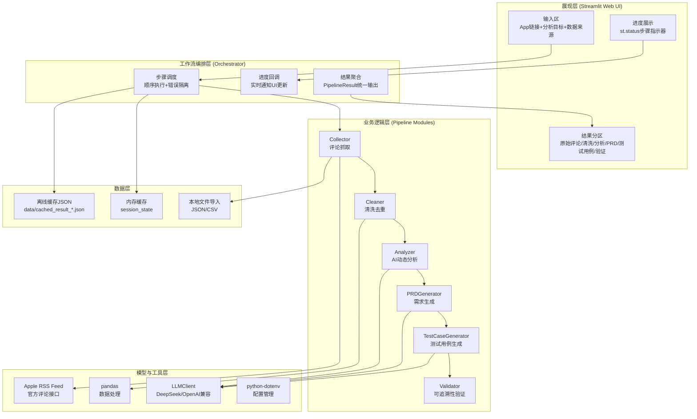
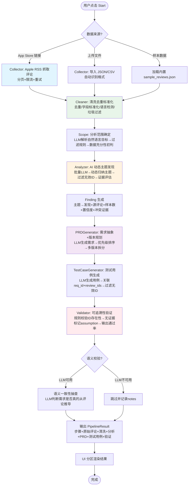
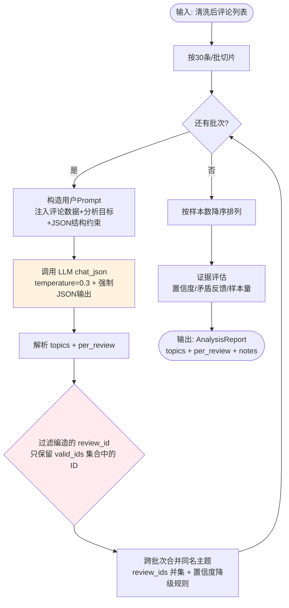
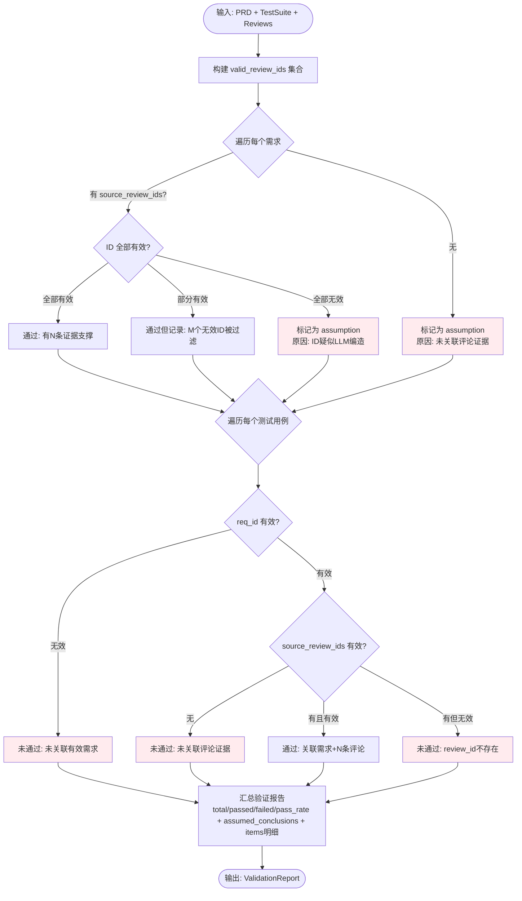

# S2 技术方案草图

> 项目：App Store 评论分析与版本规划工具
> 阶段：技术方案草图
> 日期：2026-08-20

---

## 一、系统总体架构

### 1.1 架构分层图

### 1.2 架构设计原则

| 原则 | 说明 |
|:---|:---|
| **模块化** | 抓取/清洗/分析/PRD/测试用例/验证各模块独立，单一职责，通过 orchestrator 编排 |
| **确定性与模型驱动分离** | 抓取、清洗、去重、验证用确定性规则；主题发现、需求生成、测试用例生成用 LLM |
| **可追溯优先** | 所有 LLM 输出必须带 source_review_ids，生成时过滤无效 ID，validator 再校验 |
| **容错降级** | 步骤级错误隔离，LLM 失败不影响已完成步骤；无 API Key 时自动加载离线缓存 |
| **配置外部化** | 模型、温度、页数、间隔等参数全部通过 config.py + 环境变量管理 |

---

## 二、核心工作流程图

### 2.1 端到端主流程

### 2.2 LLM 动态主题发现子流程

### 2.3 可追溯性验证子流程

---

## 三、模块边界与职责说明

| 模块 | 文件 | 核心职责 | 输入 | 输出 | 是否用LLM |
|:---|:---|:---|:---|:---|:---|
| **Collector** | `pipeline/collector.py` | App Store 评论抓取 + 本地文件导入 | App链接 / JSON/CSV文件 | 原始评论列表 + CollectReport | 否 |
| **Cleaner** | `pipeline/cleaner.py` | 去重、字段标准化、语言检测、垃圾过滤 | 原始评论列表 | 清洗后评论 + CleanReport | 否 |
| **Analyzer** | `pipeline/analyzer.py` | LLM 动态主题发现、单条评论标注、证据评估 | 清洗后评论 + 分析目标 | AnalysisReport（topics + per_review） | 是 |
| **PRDGenerator** | `pipeline/prd_generator.py` | 需求抽象、优先级排序、多版本规划 | 分析结果 + 评论 + 分析目标 | PRD（problem_summary + requirements + version_plan） | 是 |
| **TestCaseGenerator** | `pipeline/testcase_generator.py` | 基于需求生成测试用例，关联评论 | PRD需求 + 评论 | TestSuite（test_cases） | 是 |
| **Validator** | `pipeline/validator.py` | 可追溯性规则校验，无证据标记assumption | PRD + TestSuite + 评论 | ValidationReport（通过率+明细+假设列表） | 否（纯规则） |
| **Orchestrator** | `pipeline/orchestrator.py` | 工作流编排、步骤调度、进度回调、错误隔离 | App链接/评论 + 分析目标 | PipelineResult（全步骤聚合结果） | 否（调度） |
| **LLMClient** | `models/llm_client.py` | LLM API 统一封装、重试、超时、JSON解析 | messages + 配置 | LLMResponse（content + usage） | - |
| **Config** | `config.py` | 环境变量加载、配置管理、参数默认值 | .env / 环境变量 | Settings 单例 | 否 |
| **App** | `app.py` | Streamlit UI、输入区、进度展示、结果渲染、缓存加载 | 用户交互 | Web 界面 | 否 |

---

## 四、技术选型说明

### 4.1 为什么选 Streamlit 做 UI

| 考量 | 说明 |
|:---|:---|
| **开发效率** | 纯 Python 编写，无需前端技术栈，快速原型验证 |
| **交互能力** | 原生支持 st.status 进度展示、expander 折叠、dataframe 表格、文件上传，满足本项目所有 UI 需求 |
| **部署简单** | 单条命令 `streamlit run app.py` 启动，无需构建、无需服务器 |
| **生态兼容** | 与 pandas、matplotlib 等数据处理库无缝集成 |

### 4.2 为什么用 Apple RSS Feed 而不是页面爬取

| 考量 | 说明 |
|:---|:---|
| **官方接口** | Apple 提供 Customer Reviews RSS Feed，返回结构化 JSON，稳定可靠 |
| **合规性** | 不违反网站爬取政策，无反爬风险 |
| **数据完整** | 包含 review_id、rating、version、author、content、date 等完整字段 |
| **限制透明** | 最多10页/约500条，限制明确，可在 UI 中透明说明 |

### 4.3 为什么清洗和验证用确定性规则而不是 LLM

| 考量 | 说明 |
|:---|:---|
| **可复现性** | 去重、标准化、ID校验是确定性操作，每次运行结果一致，LLM 会引入随机性 |
| **成本效率** | 规则执行毫秒级，LLM 调用耗时且消耗 token |
| **准确性** | ID 存在性校验用集合查找 100% 准确，LLM 可能遗漏或误判 |
| **可审计** | 规则逻辑透明可审计，LLM 决策是黑盒 |

### 4.4 为什么主题发现、需求生成、测试用例生成必须用 LLM

| 考量 | 说明 |
|:---|:---|
| **动态泛化** | 不同 App 的问题主题千差万别，固定关键词映射无法覆盖，LLM 能从任意评论中动态归纳 |
| **语义理解** | 需求抽象和测试用例生成需要理解评论语义并转化为结构化的产品语言，规则无法做到 |
| **证据关联** | LLM 能在生成需求/用例时主动关联相关评论 ID，实现可追溯 |
| **笔试要求** | 明确要求"至少一个核心语义任务必须是模型驱动的"，"不能仅靠固定关键词/正则/查找表" |

---

## 五、风险识别与对策

| 风险 | 概率 | 影响 | 对策 |
|:---|:---|:---|:---|
| **LLM 编造 review_id** | 中 | 高（可追溯链断裂） | 三重防护：①Prompt 强制要求 ID 来自输入 ②生成时用 valid_ids 集合过滤 ③validator 再校验，无效的标记 assumption |
| **LLM 输出非 JSON** | 中 | 中（解析失败） | ①使用 response_format 或 Prompt 约束 ②safe_json_loads 容错解析 ③解析失败时记录日志并重试 |
| **Apple RSS 数据量不足** | 高 | 中（分析样本少） | ①UI 透明说明最多500条限制 ②分析结果中标注样本量和置信度 ③支持导入外部 JSON/CSV 补充数据 |
| **LLM API 限流/超时** | 中 | 中（分析中断） | ①指数退避重试3次 ②批量处理减少调用次数 ③失败时明确提示用户，不静默 |
| **无 API Key 环境无法演示** | 高 | 高（面试官看不到效果） | ①预生成笔试指定 App 的完整缓存 ②UI 自动检测配置缺失并加载缓存 ③醒目标记"非实时结果" |
| **不同 App 输出质量差异** | 中 | 中（泛化能力不足） | ①动态主题不预设分类 ②Prompt 通用化设计 ③支持导入任意评论数据测试 |
| **Streamlit 重渲染导致重复计算** | 低 | 低（性能） | ①使用 st.session_state 存储结果 ②@st.cache_data 缓存数据加载 ③按钮触发后才执行流水线 |

---

## 六、关键流程说明

### 6.1 评论抓取流程

1. 解析 App Store 链接，提取 app_id（支持 us/cn 链接，统一用美国区 RSS）
2. 调用 iTunes Lookup API 获取 App 元信息（名称、开发商、分类）
3. 循环调用 Apple Customer Reviews RSS Feed，每页50条，最多10页
4. 每页请求间隔 1.5s，失败时指数退避重试
5. 将 RSS 原始 entry 扁平化为内部标准结构（review_id、content、rating、version、author、date）
6. 输出 CollectReport（页数、成功数、原始评论数、数据来源）

### 6.2 防幻觉三重防护流程

1. **Prompt 层**：System Prompt 明确要求"review_ids 必须严格来自输入的评论 ID，禁止编造"
2. **生成层**：LLM 返回后，代码用 `valid_ids = {所有真实评论ID}` 集合过滤，只保留在集合中的 ID，`sample_count` 重新计算为过滤后的长度
3. **验证层**：validator 再次校验每个需求和用例的 source_review_ids，全部无效的标记为 `assumed_conclusions`，部分无效的记录明细

### 6.3 离线缓存加载流程

1. 页面初始化时调用 `settings.validate_llm()` 检查 API Key 配置
2. 如果配置缺失 + 尚无结果 + 用户未点击任何按钮，自动调用 `load_cached_result()` 加载 `data/cached_result_app_839285684.json`
3. 用 `_build_pipeline_result_from_cache()` 将缓存 JSON 构造为 PipelineResult 对象，填充所有步骤和分区数据
4. 设置 `st.session_state["is_cached"] = True`
5. 结果区顶部显示 `st.warning`："⚠️ 当前显示缓存示例数据（App ID: 839285684），非实时分析结果"
6. 用户也可手动点击"加载离线缓存结果"按钮触发

---

## 七、模块优先级排序

基于业务价值和技术依赖关系，对各模块实施优先级排序如下：

| 优先级 | 模块 | 排序理由 |
|:---|:---|:---|
| **P0** | Collector（评论抓取） | 数据源头，所有后续模块的输入依赖，必须最先实现 |
| **P0** | Cleaner（数据清洗） | 数据质量保障，去重和标准化是分析准确性的前提 |
| **P0** | Analyzer（AI动态分析） | 核心语义模块，笔试硬性要求"至少一个核心语义任务模型驱动"，是项目差异化核心 |
| **P1** | Validator（可追溯性验证） | 质量保障模块，确保所有结论有证据支撑，笔试硬性要求 |
| **P1** | PRDGenerator（需求生成） | 产品价值输出模块，将分析结果转化为可执行需求 |
| **P1** | TestCaseGenerator（测试用例生成） | 完整链路闭环模块，笔试要求"测试用例可追溯到评论" |
| **P2** | Orchestrator（工作流编排） | 串联模块的调度层，可在核心模块稳定后集成 |
| **P2** | Streamlit UI | 交互展示层，核心逻辑跑通后再做 UI 优化 |
| **P2** | 离线缓存降级 | 体验优化模块，保障无 API Key 环境可演示，非核心链路 |

**实施路径**：P0 模块先独立开发并单元测试 → P1 模块基于 P0 输出开发 → P2 模块在全链路跑通后集成优化。

---

## 八、关键技术矛盾点与权衡分析

### 矛盾点 1：LLM 动态分析 vs 规则确定性分析

| 维度 | LLM 动态分析 | 规则确定性分析 |
|:---|:---|:---|
| 优点 | 泛化能力强，能处理任意 App 的评论，动态发现新问题 | 执行快、成本低、结果可复现、无幻觉风险 |
| 缺点 | 有幻觉风险、调用成本高、结果有随机性、不可完全复现 | 无法处理未预设的分类，泛化能力差，需要人工维护关键词表 |

**权衡决策**：采用**混合策略**——
- 主题发现、需求生成、测试用例生成等**语义理解任务**用 LLM（满足笔试"模型驱动"硬性要求，保证泛化能力）
- 去重、字段标准化、ID 存在性校验等**确定性操作**用规则（保证可复现、低成本、无幻觉）
- LLM 输出后用规则做**后处理校验**（过滤无效 ID、重算 sample_count），兼顾泛化能力和结果可靠性

### 矛盾点 2：分析全面性 vs 数据量限制

| 维度 | 追求全面性 | 接受数据量限制 |
|:---|:---|:---|
| 优点 | 覆盖更多历史评论，减少长尾问题遗漏 | 实现简单，Apple RSS 官方接口稳定合规 |
| 缺点 | 需要爬取页面或多数据源，违反笔试"不应只爬页面"要求，有反爬风险 | 最多500条，可能遗漏早期版本的历史问题 |

**权衡决策**：**接受 Apple RSS 500条限制，透明告知**——
- 使用官方 RSS Feed，合规稳定，符合笔试"探索更合适的数据获取方式"的要求
- 在 UI 和文档中**透明说明数据限制**，不隐瞒
- 分析结果中标注样本量和置信度，数据不足时自动降级 confidence 为 low
- 支持导入外部 JSON/CSV 补充数据，给用户留扩展口

### 矛盾点 3：防幻觉严格度 vs 分析覆盖率

| 维度 | 严格防幻觉 | 宽松允许覆盖 |
|:---|:---|:---|
| 优点 | 所有结论都有真实评论证据，可追溯链完整，符合笔试要求 | 主题覆盖率高，不会因为 ID 过滤丢失有价值的发现 |
| 缺点 | LLM 输出的无效 ID 被过滤后，部分主题可能样本数减少甚至被丢弃 | 可能存在编造 ID，可追溯链断裂，结论无依据 |

**权衡决策**：**严格防幻觉优先，覆盖率其次**——
- 笔试核心要求是"每个发现必须有 source_review_ids"，可追溯性是硬性指标
- 三重防护（Prompt约束 + 生成时过滤 + validator再校验）确保 ID 100% 真实
- 过滤后样本数不足的主题自动标记 confidence=low，不丢弃但明确告知不确定性
- 宁可少几个主题，也不要一个无证据的假结论

### 矛盾点 4：Streamlit 快速原型 vs 专业前端框架

| 维度 | Streamlit | React/Vue 等专业框架 |
|:---|:---|:---|
| 优点 | 纯 Python 开发，快速原型，与数据分析生态无缝集成，笔试项目周期短适合 | 交互体验好，性能优，可扩展性强 |
| 缺点 | 交互模式受限（每次交互重渲染），复杂状态管理困难 | 开发成本高，需要前后端分离，笔试项目周期内难以完成 |

**权衡决策**：**选择 Streamlit，用工程手段弥补短板**——
- 笔试项目核心是"vibe coding 能力"和"全流程产品分析"，不是前端工程
- Streamlit 开发效率高，能快速将核心逻辑产品化
- 用 `st.session_state` 持久化结果、按钮触发才重新执行、`@st.cache_data` 缓存数据加载等工程手段，解决重渲染重复计算问题
- 满足笔试"可运行 UI"要求即可，不过度追求前端体验

---

*文档结束*
